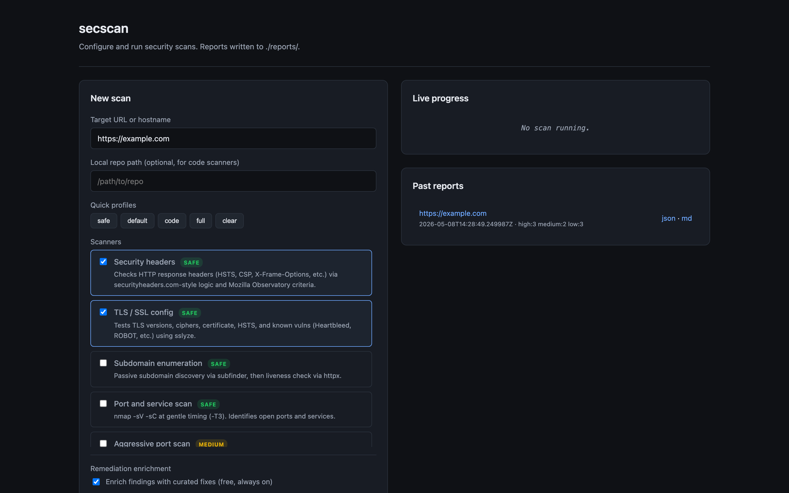
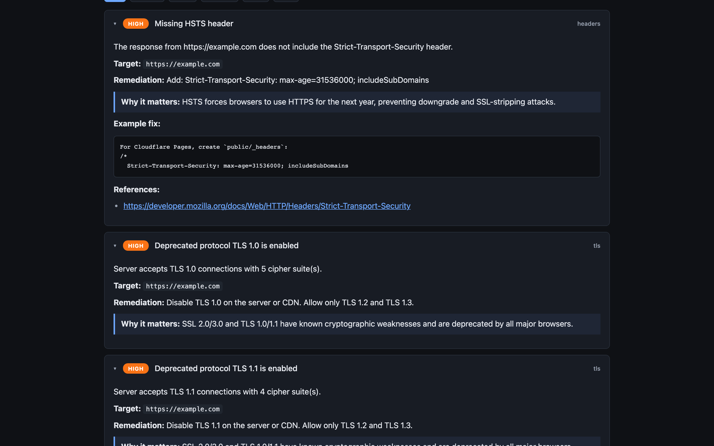

# Building secscan: one CLI for the security tools we already use

Every time I ship a small web project, the security checklist looks the same. Run an SSL test. Check the headers. Run nuclei against the live site. Run subfinder to spot forgotten subdomains. Run semgrep, trivy, and gitleaks on the source. Seven terminal tabs, twelve browser tabs, and a markdown file to paste results into. Three months later, do it all again, and try to remember what was already fixed.

The tools themselves are great. The workflow around them is the mess. So I wrote `secscan`, a Python wrapper that runs the battery for you, produces a single report in three formats, and optionally uses an LLM to turn each finding into something you can actually act on. It's MIT licensed and on PyPI.

This post is about the design choices and the things it deliberately does not do. If you already use a paid product like Snyk or Tenable, you probably don't need this. If you're a solo developer or a small team running a side project on a small VPS and you want a half-decent security baseline, read on.

## The problem

Web security scanning is fragmented. The good open-source tools each cover one slice:

- `nuclei` for template-based vulnerability checks
- `nmap` for port and service discovery
- `subfinder` and `httpx` for subdomain enumeration and live host probing
- `sslyze` for TLS configuration
- OWASP ZAP for spider and active scan
- `semgrep` for source-code patterns
- `trivy` for container and dependency CVEs
- `gitleaks` for leaked secrets in git history

Each has its own CLI, output format, and quirks. To get a complete picture you run all of them, paste outputs into a doc, and triage the result. There is no shared schema, so deduplicating findings across tools is on you.

The other failure mode is the remediation gap. You get a finding like `Strict-Transport-Security header is missing` and a generic recommendation: "Add a Strict-Transport-Security header." Useful if you've configured HSTS before. Useless if you haven't, and don't know whether your site lives behind Cloudflare, Vercel, an Astro `_headers` file, an nginx config, or all four.

I wanted one command that runs the battery, produces an integrated report, and points at where to put the fix.

## What secscan is

`secscan` is a Click CLI plus a small FastAPI dashboard. It orchestrates the tools above (it does not replace any of them), normalises findings into a common shape, and renders unified HTML, Markdown, and JSON reports.

```
pip install secscan
secscan scan https://example.com
```

That gives you the safe scans: headers, TLS, subdomain enumeration, live host probing, port scan, nuclei templates, and if you point it at a repo with `--repo`, semgrep, trivy, and gitleaks against your source. Each scanner has a risk rating of `safe`, `low`, `medium`, or `high`. Anything medium or higher refuses to run without `--i-accept-risk`, and prints what it's about to do first. The point is not to make the tool annoying. The point is to make it hard to fire an aggressive nmap or a full ZAP active scan at production by accident, while making it trivial to run the polite ones.

The web dashboard is the same thing through a browser. Pick a target, pick scanners, click run, watch progress, read the report inline.



Reports are written to `./reports/<target>-<timestamp>/` as `report.html`, `report.md`, and `report.json`. The HTML one is for reading. The Markdown one is for committing into a repo or pasting into a PR. The JSON one is for whatever you want to do in CI.

## How it works

The codebase has four moving parts.

`scanners/` has one file per scanner. Each subclasses `BaseScanner`, declares its risk level and any required external tool, and implements `_run()` which appends `Finding` objects to a result. There is no plugin system magic. New scanners get registered explicitly in `scanners/__init__.py`. Adding one is roughly fifty lines: subclass, set risk, shell out to the tool, parse output, append findings.

`runner.py` orchestrates the scanners, applies risk gating, parallelises where it's safe, and aggregates results. Risk gating is enforced here, not in the CLI, so the dashboard and the GitHub Action share the same checks.

`reports/` has separate renderers for HTML (Jinja2 template), Markdown, and JSON. Same finding data, three views. Keeping these separate means you can change the JSON schema without touching the HTML, which matters when CI starts depending on the JSON.

`remediation/` enriches findings with fix advice. More on this next.

For CI, the repo ships a GitHub Actions workflow. Drop it in `.github/workflows/`, set the target as a repo variable, and you get a weekly scan plus on-demand runs. Reports get uploaded as artifacts. If new High or Critical findings appear, it opens an issue.

## The remediation layer

This is the part I had the most fun with.

When a scanner reports a finding, you get back a short title like "Missing Content-Security-Policy". Generic advice for that finding lives in a hand-written database (`remediation/static_db.py`) keyed on the finding signature. The static DB covers HSTS, CSP, missing security headers, deprecated TLS, exposed services like Redis, MongoDB, and SMB, default credentials, leaked secrets, and so on. It's curated, not generated. You get this layer for free, with no API key.

The second layer is optional. If you set `ANTHROPIC_API_KEY`, secscan sends each finding to Claude with relevant context attached. For code findings (semgrep, trivy, gitleaks) it includes the lines around the offending location. For header findings it includes your project's `_headers`, `vercel.json`, or `astro.config.*` file if it can find one. The model returns a tailored fix instead of a generic one.

The difference in practice: instead of "Add a Strict-Transport-Security header", you get the exact line to add, the file it goes into, and the specific `max-age` and directives appropriate for a site that already has a working CSP and serves on a wildcard subdomain. Sometimes the model is wrong. When it's wrong, the static DB fallback is right behind it.



Cost works out to cents per scan with Sonnet. Findings are cached by hash, so re-scanning the same target reuses prior fixes. On privacy: by default, code snippets and config files do leave your machine. The `--no-code` flag keeps them local and sends only finding metadata. The `--no-ai` flag skips the API entirely and falls back to the static DB. Worth thinking about before you point it at a repo with anything sensitive in it.

## How to try it

Pick whichever fits.

Local install:

```
pip install secscan
secscan scan https://example.com
```

Docker, which bundles nuclei, nmap, subfinder, httpx, trivy, semgrep, and gitleaks:

```
git clone https://github.com/Jitesh17/secscan.git
cd secscan
export ANTHROPIC_API_KEY=sk-ant-...    # optional
docker compose up -d
# open http://localhost:8765
```

GitHub Actions:

```
cp .github/workflows/security-scan.yml YOUR_REPO/.github/workflows/
```

Set the target URL as a repo variable. You get weekly scans plus a `workflow_dispatch` trigger.

## What it's not, and what's next

It's worth being clear about what `secscan` is not.

It is not a replacement for OWASP ZAP or Burp Suite. Those are interactive web app pentesting tools with proxies, intercept, and fuzz workflows. ZAP's automated scans are wrapped here, but the manual workflow Burp gives you is a different thing.

It is not a SAST product. Semgrep is great, and secscan runs it, but if you need pull-request-blocking SAST with rules tuned to your stack, look at Snyk, Sonar, or Semgrep's hosted product.

It is not a vulnerability management platform. Once you have hundreds of findings across dozens of services, you want something like DefectDojo or a managed product to track ownership, deduplicate across tools, and burn down a backlog. `secscan` produces reports. It does not manage their lifecycle.

It also has rough edges. There's no support for authenticated scans yet. Cookies and bearer tokens are on the list. The AI enrichment is good for well-known finding categories; novel or compound findings get generic advice. Auto-rated severity is best effort, and a human still has to triage. The dashboard is single-tenant and has no auth, so you should run it locally or behind your own reverse proxy. It's been tested on a handful of personal projects, which means surprises are likely.

What I'd like to add next:

- A pre-commit hook for the source-code scanners
- Slack and Teams webhooks so the GitHub Action posts findings where people read
- Authenticated scan support, starting with cookie-based auth
- Optional `dnsx` and `katana` integration so the dashboard knows about the wider attack surface, not just the URL you typed

If you try it and something breaks, please open an issue: https://github.com/Jitesh17/secscan/issues. If you find a security bug in `secscan` itself, email me first at gosar95@gmail.com so we can fix it before it goes public.
